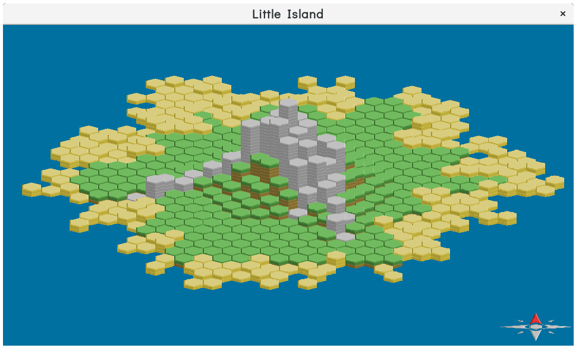

This is an experiment in learning Rust. It is, eventually, to be an island
survival game, drawing inspiration from Rimworld, The Sims, and Minecraft.
And also, a basic engine for that game, which might be extensible to other
things I feel like playing with.

If this ever gets to the point where it might be useful for someone else,
I'll increase the version to at least 1.0.0. Right now, it definitely isn't.

This crate is currently a binary, but the plan is to split this into an
engine and a game — or maybe eventually several games — which use that
engine.

Currently, draws an "island", which you can rotate with page up and page
down keys or by clicking on the compass rose. By the end of Christmas break,
I plan for it to be Slightly More exciting: a random-terrain-generation
algorithm. See the [TODO list](TODO.md) for plans and vague thoughts.

